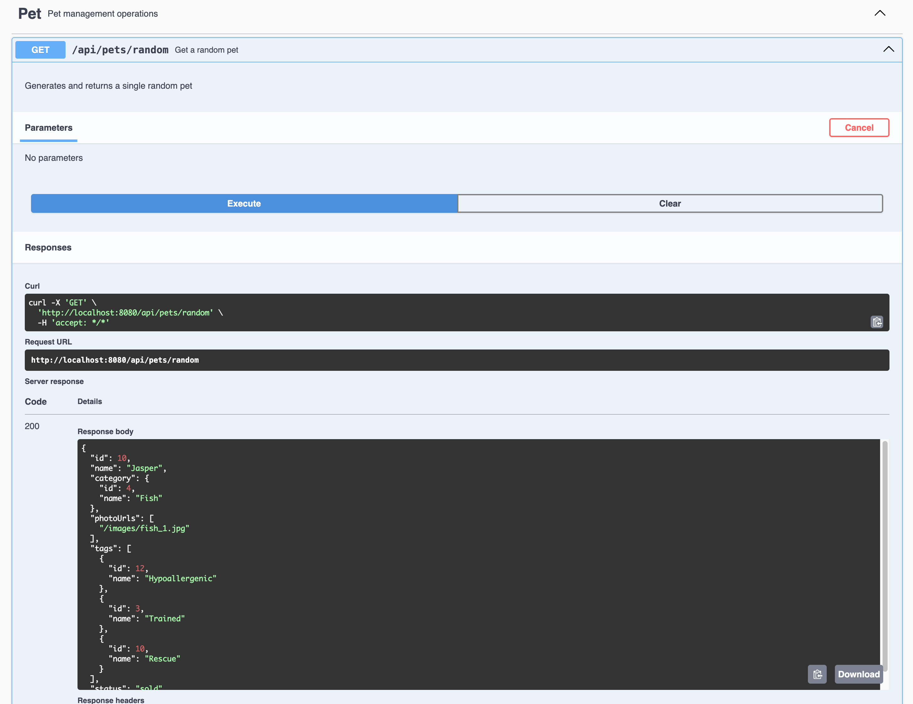

# OpenAPI spec generation

Generate OpenAPI specifications using Amp

```bash
amp -x "Analyze all Express routes in src/routes/ and generate OpenAPI documentation"
```
[Example Thread](https://ampcode.com/threads/T-b6961337-c62b-4237-9516-6a5f1f255112)

### Result
The generated OpenAPI spec can be viewed here: [openapi.yml](openapi.yaml)


## Add `springdoc` to a spring-boot application

```bash
amp -x "Analyze this application's RestControllers, add the https://springdoc.org/ plugin to application and ensure that all endpoints are properly annotated"
```
[Example Thread](https://ampcode.com/threads/T-8ad6b9be-3e3c-492e-ab19-30e989076933)

### Result

