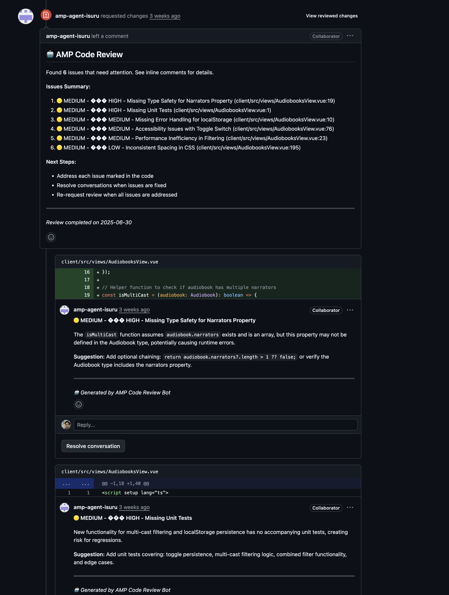
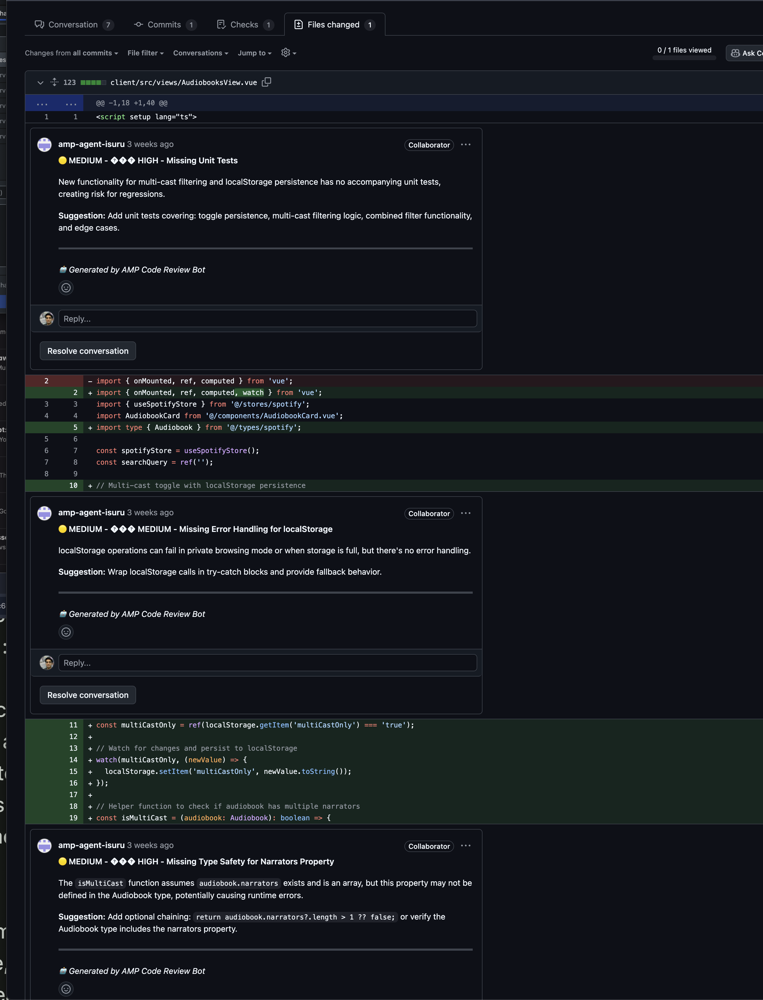

# GitHub Code Review Bot with Amp

This guide shows how to set up an automated code review bot using Amp that comments on pull requests with security, performance, and code quality feedback.

As Amp is a CLI tool, It can be used anywhere you can run an CLI. In this case we take the code code diff and provide structured feedback on issues like security vulnerabilities, missing tests, and best practices violations.


## Demo

### Live Example PR
Example PR Review Output: https://github.com/Isuru-F/demo-latest-audiobooks/pull/82

### Output Screenshots




## How it Works

1. **Trigger**: Runs on every PR opened or updated
2. **Diff Generation**: Extracts changes between base and head commits  
3. **Analysis**: Feeds the diff to Amp CLI with a structured prompt
4. **Review Creation**: Parses Amp's output and creates inline PR comments using the GitHub API
5. **Cleanup**: Dismisses previous bot reviews to avoid clutter

## Setup Instructions

### 1. Add the Workflow File

Create `.github/workflows/amp-review-bot.yml` in your repository with the provided workflow configuration.

There is an example you can use [here](https://github.com/sourcegraph/amp/blob/main/guides/github-code-review-bot/amp-review-bot.yml)

### 2. Required Secrets

Add these secrets in your GitHub repository settings:

- **`AMP_API_KEY`** - Your Amp API key from Sourcegraph
- **`AMP_REVIEW_GH_TOKEN`** - GitHub Personal Access Token with these permissions:
  - `contents: read`
  - `pull-requests: write`

### 3. GitHub API Permissions

The workflow uses these GitHub APIs:
- **Pull Requests API** - To fetch PR data and create reviews
- **Git Data API** - To get commit SHAs and generate diffs
- **Review Comments API** - To create inline comments

## Customizing the Review Prompt

Edit the prompt in the "Run AMP review" step (lines 74-110) to focus on specific areas:

```yaml
echo "Please analyze the following diff for:"
echo "- Missing or insufficient unit tests"        # ← Customize these
echo "- Security vulnerabilities"                  # ← focus areas
echo "- Performance issues"
echo "- Code quality problems"
echo "- Architecture concerns"
echo "- Best practices violations"
```

## Output Format

The bot expects Amp to return structured feedback in this format:

```
**Severity: [HIGH|MEDIUM|LOW]**

### Issues Found:

1. **🔴 HIGH - [Issue Title]**
   - FILE: path/to/file.js
   - LINE: 42
   - DESCRIPTION: [Issue description]
   - SUGGESTION: [How to fix]
```

## Key Features

- **Inline Comments**: Creates specific line-by-line feedback
- **Severity Levels**: Categorizes issues by priority (🔴 HIGH, 🟡 MEDIUM, 🟢 LOW)
- **Auto-cleanup**: Removes previous bot reviews on new commits
- **Diff-aware**: Only comments on changed lines in the PR
- **Fallback Handling**: Creates general comments if inline parsing fails

## Requirements

- Node.js 22+ (handled by workflow)
- Valid Amp API key
- GitHub repository with Actions enabled
- Proper token permissions

The bot will automatically review all future PRs and provide actionable feedback to improve code quality.
