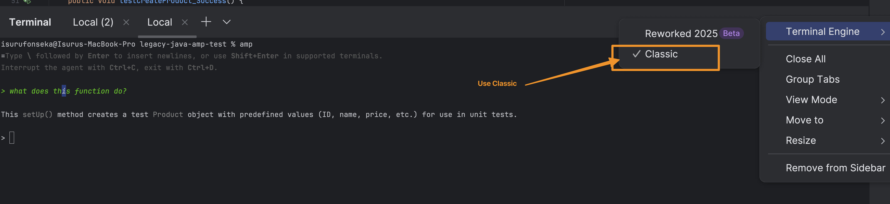

This guide shows you how to set up Amp with JetBrains IDEs for additional context. When enabled, Amp automatically includes your open JetBrains file and text selection with every message, just like it does in VS Code.

## Setup Steps

### 1. Add the JetBrains MCP Server

Install the [JetBrains MCP Server plugin](https://plugins.jetbrains.com/plugin/26071-mcp-server):

- Open your JetBrains IDE (IntelliJ IDEA, PyCharm, WebStorm, etc.)
- Go to **Settings/Preferences** → **Plugins**
- Search for and install **MCP Server**
- Restart your IDE


### 2. Install Amp CLI

Install or update to the latest version [Installation reference](https://ampcode.com/manual#getting-started)

### 3. Restart JetBrains IDE

Close and reopen your JetBrains IDE, then open a new terminal within the IDE.

### 4. Launch Amp

In your JetBrains terminal, type: 

```bash
amp
```

It will start up and be waiting for your prompt 


## Testing the Integration

To verify everything works:

1. Open a code file in your editor
2. Highlight an entire method or function
3. In the Amp terminal, ask: "What does this function do?"

Amp will automatically know what file you're in and which lines you've highlighted. No need to paste code or explain context.


## Troubleshooting

### Terminal Issues

If Amp doesn't connect to your IDE:

- Switch to classic terminal mode in **Settings/Preferences** → **Tools** → **Terminal**
- Uncheck "Use new terminal" option
- Restart the terminal


### Using External Terminal

Run Amp from any terminal with JetBrains integration:

```bash
amp --jetbrains
# or without installing
npx @sourcegraph/amp --jetbrains
```
