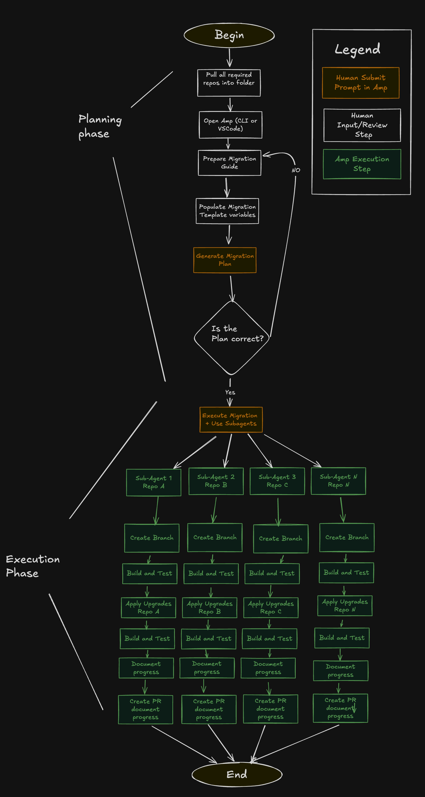

# Multi-Repository Upgrade with Amp

This guide shows how to use Amp to plan and execute upgrades across multiple repositories simultaneously using sub-agents for parallel processing.

## How it Works

1. **Planning**: Create upgrade documentation and criteria
2. **Template**: Use a migration template to generate upgrade plans
3. **Execution**: Deploy sub-agents to handle multiple repositories
4. **Monitoring**: Track progress and PRs across all repositories

## Example

### Live Example
[Screenshot of multiple PRs being created across repositories]

### Progress Dashboard


## Setup Instructions

### 1. Create Upgrade Documentation

Define your migration scope in a template file:

```markdown
## Upgrade: [Framework] from v[X] to v[Y]

### What to upgrade:
- Update package.json dependencies
- Migrate deprecated API calls
- Update configuration files

### Exclusion criteria:
- Skip repositories on version < [X]
- Skip archived repositories
- Skip if custom implementation detected

### Success criteria:
- All tests pass
- Build completes successfully
- No breaking changes introduced
```

### 2. Generate Migration Plan

Ask Amp to create a detailed plan:

```
Using the migration template above, analyze these 50 repositories and create an upgrade plan. 
Identify which repos need upgrading and create a step-by-step execution plan.
```

### 3. Execute with Sub-agents

Launch parallel upgrades:

```
Execute the migration plan using sub-agents. Create one agent per repository and track progress. 
Each agent should:
1. Create a feature branch
2. Apply the upgrades
3. Run tests and builds  
4. Create a pull request
5. Report status back
```

## Key Features

- **Parallel Processing**: Multiple sub-agents work simultaneously
- **Progress Tracking**: Real-time status of all upgrades
- **Auto-PR Creation**: Pull requests created automatically
- **Build Validation**: Tests run before PR creation
- **Rollback Support**: Failed upgrades can be reverted

## Migration Template

The migration template provides structured instructions for Amp to analyze and upgrade repositories systematically.

### Example Template

**Template Variables:**
- **{MIGRATION_URL}**: Link to official migration documentation
- **{SPEC_FILENAME}**: Name for the generated specification file  
- **{PROGRESS_FILENAME}**: Name for the progress tracking file
- **{PURPOSE}**: Description of what is being migrated

```
Analyze all projects in this folder and create a migration plan to upgrade from {PURPOSE}

Requirements:
- Generate a detailed spec plan in {SPEC_FILENAME}.md
- Use subagents for execution
- Build and test projects before migration
- Execute the migration
- Build and test projects after migration
- Document all results

Reference: {MIGRATION_URL}

Output Requirements:

Create {PROGRESS_FILENAME}.md with:
- Build status (before/after)
- Branch name and commit messages
- Migration steps executed
- Any issues encountered including blockers
- Summary of what was changed and why
- Only do the minimal required changes to complete the goal, if there is a bigger change required mark it as a blocker

Use GitHub CLI to create a pull request
Include build verification results in PR description

Do not start the migration yet, only generate the spec plan.

Once completed ask the oracle to review your plan and adjust the spec based on the oracle's advice, if you disagree use the oracle perspective because it is smarter.
```

### Real Example

```
Analyze all projects in this folder and create a migration plan to upgrade from System.Data.SqlClient to Microsoft.Data.SqlClient

Requirements:
- Generate a detailed spec plan in sqldata-migration.md
- Use subagents for execution
- Build and test projects before migration
- Execute the migration
- Build and test projects after migration
- Document all results

Reference: https://github.com/dotnet/SqlClient/blob/main/porting-cheat-sheet.md

Output Requirements:

Create progress.md with:
- Build status (before/after)
- Branch name and commit messages
- Migration steps executed
- Any issues encountered including blockers
- Summary of what was changed and why
- Only do the minimal required changes to complete the goal, if there is a bigger change required mark it as a blocker

Use GitHub CLI to create a pull request
Include build verification results in PR description

Do not start the migration yet, only generate the spec plan.

Once completed ask the oracle to review your plan and adjust the spec based on the oracle's advice, if you disagree use the oracle perspective because it is smarter.
```

### How It Works

**Inputs:**
- Migration documentation URL for reference
- Target repositories or folder structure
- Clear migration purpose and scope

**Outputs:**
- Detailed specification file with migration steps
- Progress tracking document with status updates
- Pull requests with verified builds
- Oracle-reviewed and optimized migration plan

## Monitoring Progress

Track upgrades using:

- Repository status dashboard
- Build/test results
- PR creation notifications  
- Error logs and failures

## Requirements

- Amp CLI or VS Code extension
- GitHub/GitLab access with repository permissions
- CI/CD pipelines configured for automated testing
- Clear migration documentation and criteria

The system will orchestrate upgrades across your entire repository portfolio while maintaining quality and providing visibility into the process.
