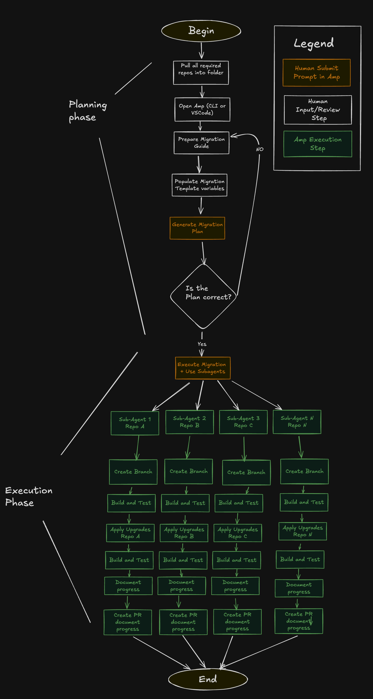

# Multi-Repository Upgrade with Amp

This guide shows how to use Amp to plan and execute upgrades across multiple repositories simultaneously using sub-agents for parallel processing.

## How it Works

We have two phases - Amp helps with both of them.
1. A planning phase - Takes input on the migration goals, and generates a detailed spec plan after analyzing the target repositories

2. An execution Phase - Execute the migration, Build and test the project and Create PRs for each Repo

### Overview



The multi-repository upgrade process follows these steps:

1. **Single Upgrade Prompt**: Start with one clear migration request
2. **Migration Template**: Apply structured template with variables for consistency
3. **Repository Analysis**: Amp analyzes target repositories and dependencies
4. **Generate Migration Plan**: Create detailed execution plan
5. **Oracle Review**: Expert validation and optimization of the migration plan
6. **Review Plan**: You review the plan and confirm it's accurate.
7. **Deploy Sub-Agents**: Launch parallel agents for each repository
8. **Progress Dashboard**: Monitor all activities, results, and PR creation

## Prerequisites

Before starting a multi-repository upgrade, ensure you have:

### Required Access
- Amp CLI or VS Code extension installed and configured
- GitHub/GitLab access with repository permissions (read/write), logged into the CLI
- Write access to target repositories for branch creation and PR submission

### Documentation Ready
- Migration documentation URL (official or internal upgrade guides)
- Clear scope definition of what needs to be upgraded
- Success criteria and validation requirements (eg. project compiles and test pass, maintain same test coverage and no more than 20% more build time)

## Migration Template

The migration template provides structured instructions for Amp to analyze and upgrade repositories systematically.

### Template Variables

Before using the template, define these variables for your specific migration:

- **{MIGRATION_URL}**: Link to official migration documentation (e.g., framework upgrade guide)
- **{SPEC_FILENAME}**: Name for the generated specification file (e.g., "react-18-upgrade") 
- **{PROGRESS_FILENAME}**: Name for the progress tracking file (e.g., "migration-progress")
- **{PURPOSE}**: Clear description of what is being migrated (e.g., "React 17 to React 18")

### Template Structure

```
Analyze all projects in this folder and create a migration plan to upgrade from {PURPOSE}

Requirements:
- Generate a detailed spec plan in {SPEC_FILENAME}.md
- Use subagents for execution
- Build and test projects before migration
- Execute the migration
- Build and test projects after migration
- Document all results

Reference: {MIGRATION_URL}

Output Requirements:

Create {PROGRESS_FILENAME}.md with:
- Build status (before/after)
- Branch name and commit messages
- Migration steps executed
- Any issues encountered including blockers
- Summary of what was changed and why
- Only do the minimal required changes to complete the goal, if there is a bigger change required mark it as a blocker

Use GitHub CLI to create a pull request
Include build verification results in PR description

Do not start the migration yet, only generate the spec plan.

Once completed ask the oracle to review your plan and adjust the spec based on the oracle's advice, if you disagree use the oracle perspective because it is smarter.
```

### Variable Substitution Example

[This](https://ampcode.com/threads/T-e5f31274-832a-492f-b50e-63908d25c411) example uses the upgrade template with the following variables 

```Template Variables:
{MIGRATION_URL}: https://github.com/dotnet/SqlClient/blob/main/porting-cheat-sheet.md
{SPEC_FILENAME}: sqldata-migration
{PROGRESS_FILENAME}: progress
{PURPOSE}: System.data.SqlClient to Microsoft.Data.SqlClient
```

It produced the following spec plan:
[System.data.SqlClient to Microsoft.Data.SqlClient Migration Guide](/sqldata-migration-guide.md)


## Repository Analysis - With Amp

Before generating the migration plan, Amp performs comprehensive repository analysis:

### Discovery Process
- **Repository Scanning**: Identifies all repositories in scope based on criteria
- **Dependency Mapping**: Analyzes package.json, requirements.txt, and other dependency files
- **Version Detection**: Determines current framework/library versions
- **Build System Analysis**: Identifies CI/CD configurations and test setups

### Compatibility Assessment
- **Breaking Changes**: Reviews migration documentation for potential issues
- **Dependency Conflicts**: Checks for version incompatibilities
- **Custom Implementation Detection**: Identifies repositories with custom code that may need special handling
- **Test Coverage Analysis**: Evaluates existing test suites for migration validation

## Oracle Review Process

The Oracle review is a **critical step** that significantly improves migration success rates.

### Why Oracle Review is Essential

- **Expert Analysis**: The Oracle uses advanced reasoning to identify potential issues
- **Risk Mitigation**: Catches compatibility problems, breaking changes, and edge cases
- **Optimization**: Suggests better approaches and more efficient migration paths
- **Experience**: Leverages knowledge from similar migrations and common pitfalls

### What the Oracle Reviews

- **Dependency Conflicts**: Identifies version incompatibilities and transitive dependencies
- **Breaking Changes**: Analyzes migration documentation for potential issues
- **Testing Strategy**: Ensures adequate validation and rollback procedures
- **Risk Assessment**: Evaluates migration complexity and failure scenarios

### How to Use Oracle Feedback

1. **Always Accept Oracle Recommendations**: The template specifically states to trust Oracle perspective
2. **Review Suggested Changes**: Understand why Oracle recommends specific modifications
3. **Update Migration Plan**: Incorporate Oracle feedback before proceeding
4. **Ask Follow-up Questions**: Get clarification on complex recommendations

## Sub-Agent Workflow

Each sub-agent follows a detailed 4-step process for every repository:

### Step 1: Create Branch
- **Branch Naming**: `feature/migrate-{framework}-{target-version}` (e.g., `feature/migrate-react-18`)
- **Base Branch**: Usually `main` or `master`, but can be configured
- **Branch Protection**: Ensures branch is created from latest stable version

### Step 2: Apply Upgrades
- **Dependency Updates**: Modify package.json, requirements.txt, or equivalent files
- **Code Migrations**: Update deprecated API calls and breaking changes
- **Configuration Changes**: Update build scripts, CI/CD configs, and environment files
- **Documentation Updates**: Modify README and other docs referencing old versions

### Step 3: Run Tests and Builds
- **Pre-Migration Baseline**: Record current test and build status
- **Post-Migration Validation**: Run full test suite and build process
- **Performance Verification**: Check for performance regressions
- **Integration Testing**: Validate with external dependencies

### Step 4: Create Pull Request
- **PR Title**: Standardized format with migration details
- **Description**: Includes build results, test outcomes, and changes summary
- **Labels**: Auto-applied migration tags for tracking
- **Reviewers**: Assigned based on repository configuration

## Example Implementation

### Live Example Output 


### Sample Output Files
Example PR https://github.com/amp-example-org/bank-app-15/pull/1


## Troubleshooting
