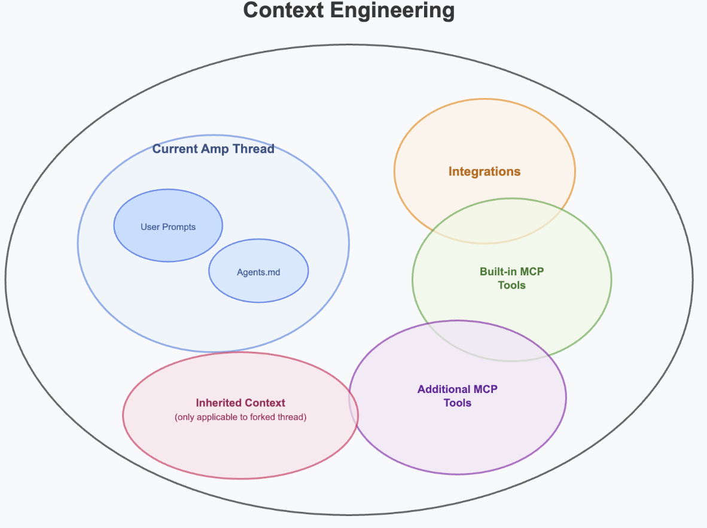

# Context Engineering for Agentic AI Tooling: A Guide to Amp

## Overview

In agentic AI systems like Amp, context engineering becomes the backbone of intelligent automation. This enables AI agents to maintain coherent understanding across complex, multi-step workflows while preserving critical context about project requirements, codebase architecture, and user intentions.

## What is Context Engineering?

Unlike traditional prompt engineering, which focuses primarily on crafting individual queries, context engineering takes a holistic view of how information flows through an AI system over time.

At its core, context engineering involves:

- **A system, not a string**: Structuring data and knowledge in ways that AI models can effectively process and utilise  
- **Context Lifecycle Management**: Maintaining relevant information across multiple prompts in a thread, and forks of threads  
- **Data Optimisation**: Ensuring that the most relevant information is prioritised and accessible when needed, avoids relevance issues or hallucinations  

In the realm of agentic AI tooling, context engineering becomes even more crucial because agents must navigate complex, multi-step workflows while maintaining awareness of project requirements, codebase structure, and user intentions. Amp isn't just responding to a single prompt, it's orchestrating a series of interconnected tasks that build upon each other.

## Core Principles & Strategy for Amp

In an agentic tool like Amp, context engineering is foundational for multi-step developer workflows. Let’s start with what Amp does in a thread when a prompt is submitted:

1. **Gather Context**: Amp uses a thinking model to first interpret the user's request, then automatically collects context using tools available to the agent to gather a comprehensive understanding of the problem  
2. **Task Planning via TODOs**: It introspects the gathered context to generate clear, actionable tasks  
3. **Tool Orchestration**: Amp coordinates code edits, test creation, documentation updates, and terminal commands to execute tasks efficiently  
4. **Subagent Delegation**: Amp can create subagents for complex instructions and offload tasks to the subagent  
5. **Complete TODOs**: Amp systematically works through the planned tasks, completing each one methodically  
6. **Validate**: Continuous checks ensure the AI's output remains aligned with user goals  

## Different Ingredients of Context in an Amp Thread

Understanding how Amp assembles and manages context requires examining the various sources of information that feed into each agent interaction:

### User Prompt

The user's initial request serves as the primary directive on what to do. Context engineering is the art of clearly communicating your goals and instructions to an LLM. It's important to guide, direct, and define intent through well-crafted prompts. Unlike human collaborators who can ask clarifying questions, Amp relies heavily on the clarity and completeness of your input. This makes how you communicate all the more important.

**Best Practices:**
- **Be Clear and Specific**: Provide enough context and detail so the model fully understands what is being asked. For example, rather than saying "sort array," say "sort a list of integers in ascending order using Python."  
- **Mention the context** with @ mentions or framework when relevant  
- **Use Plain Language**: Write prompts using simple, clear language. Avoid complex jargon or vague concepts that might be misunderstood  
- **Emphasise Desired Outcomes**: Clearly state what you want the model to do. Framing your prompt in a positive, goal-oriented way helps guide the model toward producing the result you need  

### Current Amp Thread

The current conversation, including user prompts and model responses that are part of the current Amp thread.

### Agent.md File

The Agent.md file serves as the foundational context document that defines how Amp's agents should behave within a specific project. This file contains:

- **Project Overview**: High-level description of the project's purpose and architecture  
- **Coding Standards**: Specific style guidelines, naming conventions, and best practices  
- **Technology Stack**: Detailed information about frameworks, libraries, and tools used  
- **Workflow Preferences**: How the user prefers certain tasks to be approached  
- **Context Priorities**: Which aspects of the codebase should receive special attention  

This file acts as a persistent memory layer that ensures consistency across all agent interactions within a project.

Amp also supports multiple Agent.md files:

- **Root level**: Maintain a general `AGENT.md` file at the project's root to provide broad, overall guidance for Amp agents  
- **Subdirectories**: Place specific `AGENT.md` files within subdirectories for context-sensitive instructions tailored to those parts of the project  
- **Config**: Use a global `AGENT.md` in `~/.config/AGENT.md` for personal or environment-wide preferences that apply across projects  

### Built-in Tools

Amp comes with a comprehensive set of built-in tools that provide agents with essential capabilities:

- **File Operations**: `bash`, `create_file`, `edit_file`, `read_file`, `list_directory`, `glob`  
- **Search & Analysis**: `codebase_search_agent`, `web_search`, `read_web_page`, `grep`  
- **Task Management**: `Task`, `todo_read`, `todo_write`, `undo_edit`  
- **Visualisation**: `mermaid`  
- **Diagnostics**: `get_diagnostics`  

### Integrations

Connect external services from ampcode.com:

- **GitHub Tools** for searching and reading issues  
- **Linear Tools** for searching and reading all Linear content, and updating issues, comments, and projects  
- **Slack Tools** for searching and reading messages  

### Additional MCP Tools

Beyond the built-in capabilities, Amp can be extended with custom MCP (Model Context Protocol) tools that provide domain-specific context and functionality. These can be configured via local MCP servers (stdio, docker) or remote MCPs using SSE connections.

**Infrastructure & DevOps:**

- **Cloud Platform Tools**: AWS, Azure, GCP service management and monitoring  
- **Container Tools**: Docker, Kubernetes deployment and orchestration  
- **CI/CD Tools**: Pipeline management, build automation, and deployment workflows  
- **Infrastructure as Code**: Terraform, CloudFormation, and configuration management  

**Communication & Collaboration:**

- **Project Management**: Jira, GitHub, Linear, GitLab etc.  
- **Communication Platforms**: Discord, Microsoft Teams etc.  
- **Knowledge Management**: Confluence, Notion, and wiki system connections  

**Development & Code Management**: Git operations, linting, formatting, static analysis, automated documentation, and comprehensive testing workflows  

**Data & Analytics**: Schema exploration, query optimisation, data visualisation, system monitoring, and custom metrics collection  

This extensibility ensures that agents can gather relevant context from external sources beyond just what is in the context window or local workspace.

### Forked Thread

Amp can fork existing threads and use the original thread as context in a new thread.

## Challenges and Considerations

Successfully implementing context engineering in Amp requires following proven strategies that maximize the effectiveness of agent interactions:

### Context Window Management

Traditional AI models face limitations in how much context they can process simultaneously. However, Amp addresses this challenge through several innovative approaches:

- **Subagent Architecture**: When tasks require extensive context, Amp can launch subagents that focus on specific aspects of the problem. This distributed approach allows the system to handle complex tasks that would overwhelm a single agent's context window. This also means that even novice users can get started with agentic tools and don't need to be experts at context window management.
- **Compacting Threads**: When Amp's context window approaches its limits during extended workflows, users can compact the thread. This allows agents to continue working on complex, multi-step tasks without losing critical context.
- **Forking Threads**: Create new threads from existing threads, preserving previous thread history and context.

## Reflection

With agentic AI assistants like Amp, context engineering will play an increasingly pivotal role in unlocking their full potential. Moving beyond traditional prompt design, context engineering introduces a structured, system-level approach that allows AI agents to operate with greater precision, consistency, and autonomy.

Looking ahead, the integration of context-aware agents will reshape how software is built, tested, and maintained. Context engineering is not just a tactical tool—it's a strategic discipline that will define how agentic AI systems evolve and scale.
