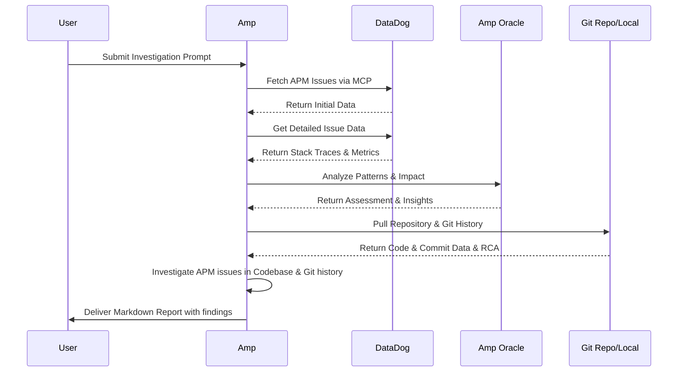

# Datadog MCP Setup Guide

This guide shows you how to set up the Datadog MCP (Model Context Protocol) server with Amp for monitoring and observability. The Datadog MCP server provides access to APM, metrics, logs, and other Datadog services.

## Use Case: Comprehensive APM Issue Investigation

Once configured, you can leverage Amp with Datadog MCP to perform deep investigations of production issues. Amp can automatically fetch APM data, analyze patterns with the Oracle, and investigate your local codebase to provide comprehensive root cause analysis and resolution recommendations.


### Amp / Datadog sequence diagram 

You can have Amp call other tools such as git or even put it's findings in Jira or confluence if you want to automate this further. 



### Example Investigation Prompt

```text
Please fetch the latest 5 APM issues from DataDog and investigate each one thoroughly. For each issue:

Gather details using available DataDog MCP tools
Analyze root causes and impact and ask the oracle to review your findings
Provide actionable recommendations for resolution

Output: Create a markdown report with your findings, including:

Issue summaries
Investigation details
Root cause analysis
Recommended fixes
Priority/severity assessment

Use all relevant DataDog MCP tools to gather comprehensive information for each issue.

For each of the project issues ask me to provide the git location for the repo locally, so you can explore the git history and the codebase to investigate the codebase deeply and find resolution as well.
```

> **⚠️ Active Development Notice**  
> The Datadog MCP server is currently in active development and is subject to change. As of August 2025, you need to request your Datadog organization to be whitelisted to use the MCP server. Contact your Datadog representative or support to request access.

## Prerequisites

- VS Code with Amp extension installed OR Amp CLI installed
- Datadog account with appropriate permissions
- macOS, Linux, or Windows with WSL support
- Organization whitelisting with Datadog (required as of Aug 2025)

## Setup Steps

### 1. Install the Datadog MCP CLI

For macOS and Linux, install the Datadog MCP CLI using the installation script:

```bash
curl -sSL https://coterm.datadoghq.com/mcp-cli/install.sh | bash
```

This will install the CLI to `~/.local/bin/datadog_mcp_cli`. The Windows version can be downloaded from the [official Datadog releases page](https://github.com/DataDog/datadog-mcp/releases).

### 2. Authenticate with Datadog

Run the authentication flow manually to set up OAuth:

```bash
datadog_mcp_cli login
```

The MCP server will automatically start the OAuth flow when started by a client, but running it manually allows you to select your Datadog site and avoids MCP client timeouts during initial setup.

### 3. Configure Amp

#### Option A: Using Amp CLI Configuration

Add the following configuration to your Amp settings file:

- **Windows**: `%APPDATA%\amp\settings.json`
- **macOS**: `~/.config/amp/settings.json`
- **Linux**: `~/.config/amp/settings.json`

```json
{
  "amp.mcpServers": {
    "datadog": {
      "command": "/Users/yourname/.local/bin/datadog_mcp_cli",
      "env": {},
      "_target": "global"
    }
  }
}
```

Replace `/Users/yourname/` with your actual home directory path.

#### Option B: Using VS Code Extension

1. Open VS Code and go to **Settings** → **Extensions** → **Amp** → **MCP Servers**
2. Click **Add MCP Server**
3. Configure the server:
   - **Server Name**: `datadog`
   - **Command or URL**: `/Users/yourname/.local/bin/datadog_mcp_cli`
   - **Arguments**: (leave empty)
   - **Environment Variables**: (leave empty unless required)

Replace `/Users/yourname/` with your actual home directory path.

### 4. Verify the Setup

Restart VS Code or your Amp CLI session after making the configuration changes. The Datadog MCP server should now be available.

## Testing the Integration

To verify the Datadog MCP integration works, ask Amp questions like:

- "What are the most recent APM issues?"
- "Show me the current error rate for my services"
- "What are the latest log entries with errors?"
- "Get metrics for CPU usage in the last hour"
- "Show me active monitors that are alerting"

Amp will automatically use the Datadog MCP server to fetch this information from your Datadog account.

## Available Capabilities

The Datadog MCP server provides access to:

- **APM**: Application performance monitoring data, traces, and service metrics
- **Logs**: Search and retrieve log data with filters
- **Metrics**: Query time-series metrics data
- **Monitors**: View and manage monitor status and alerts
- **Events**: Access Datadog events and notifications
- **Dashboards**: Retrieve dashboard information
- **Incidents**: View incident management data

## Best Practices

- Be specific in your queries to get the most relevant data
- Use time ranges when requesting historical data (e.g., "in the last hour", "today")
- Specify service names or environments when available to narrow results
- The MCP server respects your Datadog permissions - you'll only see data you have access to

## Troubleshooting

### Authentication Issues
- If you encounter authentication problems, run `datadog_mcp_cli login` again to refresh your credentials
- Verify your organization is whitelisted for MCP access

### Connection Problems
- Ensure the path to `datadog_mcp_cli` is correct in your configuration
- Check that the binary has execute permissions: `chmod +x ~/.local/bin/datadog_mcp_cli`
- Restart VS Code or Amp CLI after configuration changes

### Data Access Issues
- Verify you have the necessary permissions in your Datadog account
- Check that your organization has the required Datadog features enabled (APM, Logs, etc.)
- Contact your Datadog administrator if you're missing access to certain data sources

For additional help, consult the [Datadog MCP documentation](https://docs.datadoghq.com/mcp/) or contact Datadog support.
